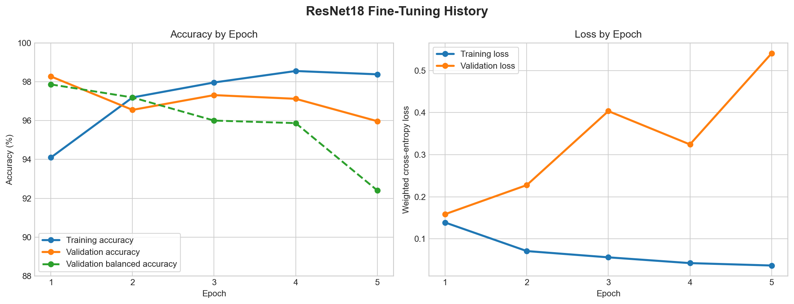
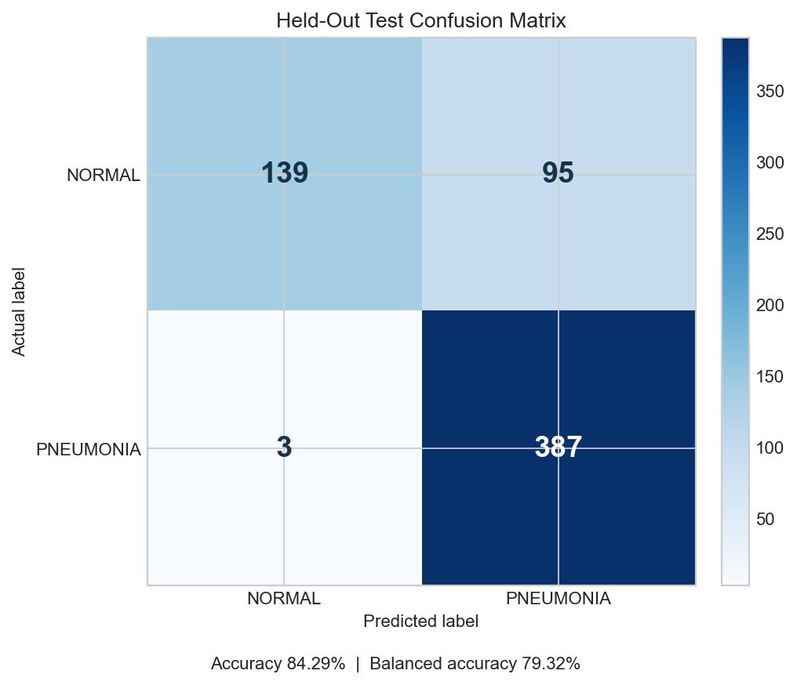
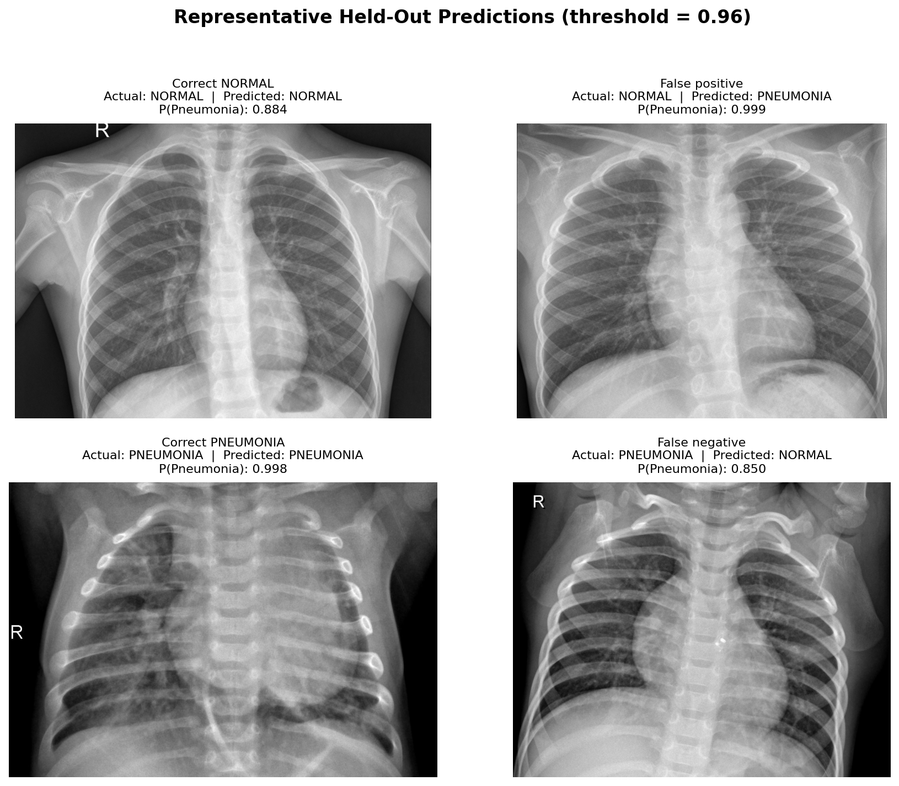
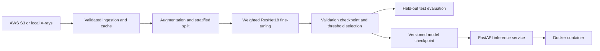
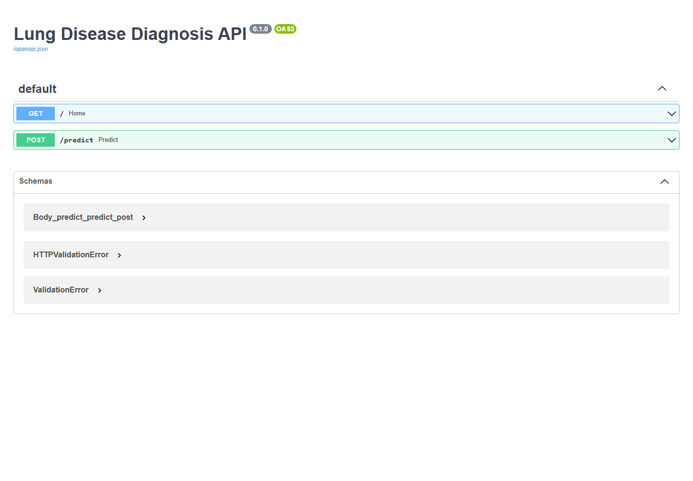

# 🩺 X-Ray Lung Classifier (Pneumonia Detection)

## 📌 Problem Statement

Pneumonia is a serious lung infection that can be life-threatening if not diagnosed early. Chest X-rays are commonly used for diagnosis, but interpretation requires expert radiologists and can be time-consuming.

This project builds an AI-powered system to automatically classify chest X-ray images into:

* ✅ NORMAL
* ❌ PNEUMONIA

The goal is to assist healthcare professionals with **fast, reliable, and scalable diagnosis support**.

---

## 🚀 Solution Approach

This project implements a **complete end-to-end MLOps pipeline**:

1. Data Ingestion (AWS S3 → Local Cache)
2. Data Transformation & Augmentation
3. Model Training (Transfer Learning using ResNet18)
4. Model Evaluation
5. Model Pusher (BentoML)
6. FastAPI Deployment
7. Docker Containerization

---

## 📊 Dataset

* Public chest X-ray dataset
* Binary classification:

  * NORMAL
  * PNEUMONIA

Structure:

```
chest_xray/
├── train/
│   ├── NORMAL/
│   └── PNEUMONIA/
├── test/
│   ├── NORMAL/
│   └── PNEUMONIA/
```

---

## 🧠 Model

### 🔥 Transfer Learning (ResNet18)

* Pretrained on ImageNet
* Fine-tuned for medical imaging
* Frozen backbone + custom classifier
* Dropout for regularization

### ⚙️ Key Improvements

* Data Augmentation (Rotation, Flip, Color Jitter)
* Proper Normalization (ImageNet stats)
* Learning Rate Optimization
* Batch Size tuning
* Overfitting reduction

---

## 📈 Model Performance

| Metric            | Value    |
| ----------------- | -------- |
| Training Accuracy | 94.10% (selected epoch) |
| Test Accuracy     | **84.29%** |
| Balanced Accuracy | **79.32%** |
| NORMAL Recall     | **59.40%** |
| PNEUMONIA Recall  | **99.23%** |

The current pipeline prints the final held-out test accuracy after training.
It uses a stratified validation split for model selection, so the test set is
not used for tuning.

The reported model uses inverse-frequency class weights, partial ResNet18
fine-tuning, and a decision threshold selected only on the validation split.

### Training History



The widening loss gap after the selected epoch shows why early stopping is
necessary: additional epochs improve training accuracy but reduce generalization.

### Held-Out Evaluation



<details>
<summary>View representative correct and incorrect predictions</summary>



</details>

---

## 🏗 Project Architecture



---

## ⚙ Tech Stack

* Python
* PyTorch
* FastAPI
* AWS S3
* Docker
* Git and GitHub

---

## ☁ Infrastructure

* AWS S3 → Dataset + Model Storage
* Local Cache → Faster training (no repeated downloads)
* Docker → Containerized deployment
* FastAPI → Model serving

### FastAPI Interface



---

## 🛠 How To Run

### 1️⃣ Clone Repo

```bash
git clone https://github.com/KunalDamahe/Lung-Disease-Diagnosis.git
cd <project_folder>
```

### 2️⃣ Create Environment

```bash
python -m venv venv
venv\Scripts\activate
```

### 3️⃣ Install Dependencies

```bash
pip install -r requirements.txt
```

### 4️⃣ Set AWS Credentials

```bash
set AWS_ACCESS_KEY_ID=your_key
set AWS_SECRET_ACCESS_KEY=your_secret
set AWS_DEFAULT_REGION=ap-south-1
```

### 5️⃣ Train Model

```bash
python train.py --data-dir C:\path\to\chest_xray
```

The dataset folder must contain `train/NORMAL`, `train/PNEUMONIA`,
`test/NORMAL`, and `test/PNEUMONIA`. If `--data-dir` is omitted, the pipeline
downloads from the configured S3 bucket once, validates it, and reuses the
persistent `artifacts/data_cache/Data` folder on later runs.

### 6️⃣ Run API

```bash
uvicorn app:app --reload
```

👉 Open: http://127.0.0.1:8000/docs

### Run with Docker

Package the newest trained checkpoint and start the API:

```powershell
powershell -ExecutionPolicy Bypass -File scripts/package_model.ps1
docker compose up --build -d
```

Open `http://127.0.0.1:8000/docs`. After retraining, run the packaging script
and rebuild the container so it includes the new checkpoint.

```powershell
docker compose down
```

---

## 🔥 Key Features

* End-to-End ML Pipeline
* Transfer Learning (ResNet18)
* Optimized Training (Reduced Overfitting)
* AWS Integration
* Production-ready API
* Dockerized Deployment

---

## 🎯 Conclusion

This project demonstrates a reproducible, containerized deep-learning prototype
for medical image classification.

It covers:

* Model Development
* Pipeline Engineering
* Cloud Integration
* Deployment

The model is intended for learning and portfolio demonstration. Its NORMAL
recall remains a known limitation, and it is **not validated for clinical use**.

---

## 👨‍💻 Author

**Kunal Damahe**
